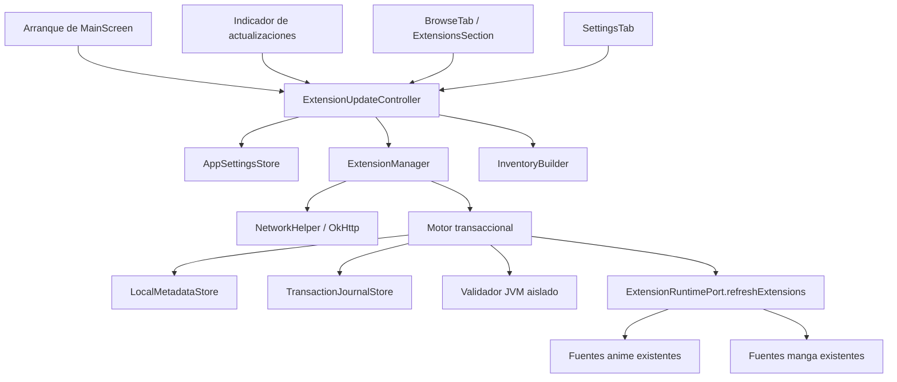

# Diseño técnico: actualización segura de extensiones

## 1. Resumen

Este diseño amplía el flujo de extensiones de `app-desktop` sin crear otro administrador ni otra pantalla. `ExtensionManager` continúa siendo la única puerta para consultar índices, descargar, convertir, validar, cargar y desinstalar extensiones. Un `ExtensionUpdateController`, compartido por el arranque, el indicador, la sección «Extensiones» de `BrowseTab` y `SettingsTab`, coordina ese componente, `AppSettings` y la operación existente `refreshExtensions`.

La instalación y la actualización se ejecutan como transacciones recuperables. El JAR activo no se toca hasta completar descarga, verificación, conversión y validación aislada. Antes de promover una actualización se guarda y verifica una copia byte a byte del JAR y sus metadatos. Un diario persistente permite restaurar el estado anterior antes de cargar extensiones tras un cierre inesperado.

Los índices antiguos siguen siendo válidos. Los campos nuevos `versionCode`, `hash` y `signature` son opcionales. Un artefacto sin integridad publicada se puede instalar, con advertencia, únicamente desde un repositorio confiable y tras confirmación explícita. Un descriptor publicado pero mal formado, no confiable o no coincidente bloquea la operación. Ninguna comprobación automática o manual descarga APK; ninguna descarga de APK ni actualización comienza sin una confirmación vigente.

Los fragmentos Kotlin de este documento son contratos de diseño, no una implementación.

## 2. Contexto y decisiones de integración

### Estado actual que se conserva

- `ExtensionManager` ya contiene `fetchRepository`, `downloadApk`, `translateApkToJar`, `loadExtension`, `loadLocalExtensionsWithErrors`, `installExtension` y `uninstallExtension`.
- `ExtensionInfo` representa el formato legado del índice y el `Json` de `ExtensionManager` ya ignora campos desconocidos.
- `MainScreen` mantiene las colecciones visibles `dynamicAnimeSources`, `dynamicMangaSources`, `installedJars` y `extensionLoadErrors` y contiene la operación local `refreshExtensions`.
- `BrowseTab` ya tiene una pestaña «Extensiones» y `SettingsTab` ya administra el directorio, `animeRepos` y `mangaRepos`.
- `AppSettings` ya persiste `extensionDirPath`, `extensionRepoUrl`, `animeRepos`, `mangaRepos` y `blacklistedExtensions`.
- La desinstalación existente cierra el classloader conocido, intenta borrar con reintentos y devuelve si hace falta usar la lista negra y completar el borrado al reiniciar.

### Decisiones principales

1. **No se crea un segundo manager.** `ExtensionUpdateController` es un coordinador de casos de uso y estado; todas las operaciones de extensión se delegan a APIs ampliadas de `ExtensionManager`.
2. **No se crea una pantalla paralela.** La lista unificada sustituye la lógica por-repositorio dentro de `ExtensionsSection`, pero permanece en `BrowseTab > Extensiones`. La configuración nueva se incorpora a `SettingsTab`.
3. **Un inventario global por `Package_ID`.** Se fusionan `animeRepos` y `mangaRepos`; un paquete aparece una sola vez aunque figure en ambas colecciones o en varios índices.
4. **Estado ajeno a Compose.** El controlador expone `StateFlow` y comandos Kotlin. Compose solo representa ese estado y reenvía intenciones.
5. **Recarga como puerto.** La operación existente `refreshExtensions` se convierte en una operación suspendible con resultado, implementada en la raíz de UI, para que `ExtensionManager` pueda solicitar recarga sin importar Compose.
6. **Validación de carga fuera del proceso principal.** El JAR candidato se prueba en un proceso JVM auxiliar de vida corta. Sus fuentes nunca se incorporan a las colecciones visibles y la terminación del proceso libera todos sus handles.
7. **Promoción serializada.** Puede haber consultas de índices concurrentes, pero las mutaciones de JAR y la recarga global se serializan. La actualización masiva procesa transacciones independientes en secuencia; un fallo no detiene las siguientes.
8. **Recuperación antes de carga.** El arranque migra ajustes, configura el directorio, recupera transacciones y eliminaciones diferidas, y solo después ejecuta `refreshExtensions`.

## 3. Arquitectura



### 3.1 Componentes y responsabilidades

| Componente | Responsabilidad | No debe hacer |
|---|---|---|
| `ExtensionUpdateController` | Disparar comprobaciones, construir confirmaciones, coordinar comandos, publicar estado compartido y reconciliar inventario | Descargar, convertir o manipular JAR directamente |
| `ExtensionManager` | Única fachada de consulta, adquisición, conversión, validación, transacción, carga y desinstalación | Importar tipos Compose o mostrar diálogos |
| `RepositoryPlanner` | Normalizar, deduplicar y ordenar repositorios confiables de anime/manga | Hacer red |
| `RepositoryIndexParser` | Decodificar el índice legado/ampliado, validar cada entrada y producir incidencias aisladas | Descargar APK |
| `VersionComparator` | Comparar `versionCode` o versiones textuales sin lanzar excepciones | Inferir orden de textos no comparables |
| `RemoteCandidateSelector` | Deduplicar por paquete, seleccionar máximo y detectar conflicto | Elegir arbitrariamente entre candidatos ambiguos |
| `InventoryBuilder` | Fusionar instalaciones y candidatos en un registro por paquete | Ejecutar acciones |
| `LocalMetadataStore` | Leer/escribir sidecars atómicos y detectar JAR heredados u huérfanos | Considerar un sidecar sin JAR como instalación |
| `ExtensionTransactionEngine` | Ejecutar y recuperar la máquina transaccional detrás de `ExtensionManager` | Informar éxito antes de recargar |
| `IsolatedCandidateValidator` | Inspeccionar identidad, legibilidad y carga en una JVM auxiliar con timeout | Publicar instancias de fuentes en el proceso principal |
| `ExtensionRuntimePort` | Desvincular fuentes visibles y ejecutar la operación existente `refreshExtensions` | Tomar decisiones de actualización |
| UI Compose existente | Representar estado, pedir confirmación y emitir comandos | Repetir reglas de versión, confianza o transacción |

### 3.2 Organización propuesta dentro de `app-desktop`

La separación es lógica; no implica un módulo nuevo.

```text
app-desktop/src/desktopMain/kotlin/
  eu/kanade/tachiyomi/extension/
    ExtensionManager.kt                 # fachada existente ampliada
    update/model/                       # modelos de dominio
    update/index/                       # parser, normalización y selección
    update/inventory/                   # escaneo y clasificación
    update/storage/                     # sidecars y diarios
    update/transaction/                 # máquina transaccional y recuperación
    update/validation/                  # protocolo del proceso JVM auxiliar
    update/ExtensionUpdateController.kt # estado compartido
  main.kt                               # raíz, refreshExtensions y BrowseTab existentes
  SettingsTab.kt                        # controles nuevos de ajustes/confianza
  Models.kt                             # AppSettings retrocompatible
```

## 4. Modelo de dominio

### 4.1 Identidades, repositorios y versiones

```kotlin
@JvmInline value class PackageId(val value: String)
@JvmInline value class NormalizedRepositoryUrl(val value: String)

data class RepositoryRef(
    val originalUrl: String,
    val normalizedUrl: NormalizedRepositoryUrl,
    val persistedRank: Int,
    val categories: Set<RepositoryCategory>, // ANIME, MANGA o ambas
    val trusted: Boolean,
)

data class VersionDescriptor(
    val text: String,
    val versionCode: Long?,
)

sealed interface VersionComparison {
    data object Lower : VersionComparison
    data object Equal : VersionComparison
    data object Greater : VersionComparison
    data object Unknown : VersionComparison
}
```

`persistedRank` se calcula al fusionar `animeRepos + mangaRepos`, en ese orden. Después de normalizar, solo se conserva la primera aparición. Si una URL aparece en ambas listas conserva el primer rango y acumula ambas categorías. Este orden total se usa para desempates y no depende del orden de finalización de la red.

### 4.2 Integridad y verificación

```kotlin
data class ArtifactHash(
    val algorithm: String, // allowlist inicial: SHA-256; ampliable
    val value: ByteArray,
)

data class ArtifactSignature(
    val algorithm: String, // allowlist inicial: Ed25519
    val keyId: String,
    val value: ByteArray,
)

data class IntegrityDescriptor(
    val hash: ArtifactHash?,
    val signature: ArtifactSignature?,
)

sealed interface VerificationExpectation {
    data object NotPublished : VerificationExpectation
    data class Required(val hash: Boolean, val signature: Boolean) : VerificationExpectation
    data class Blocked(val reason: IntegrityBlockReason) : VerificationExpectation
}

sealed interface VerificationStatus {
    data object VerifiedByHash : VerificationStatus
    data object VerifiedBySignature : VerificationStatus
    data object VerifiedByHashAndSignature : VerificationStatus
    data object UnverifiedByIndex : VerificationStatus
    data class BlockedByIntegrity(val reason: IntegrityBlockReason) : VerificationStatus
}
```

La expectativa remota y el resultado local son conceptos distintos. Antes de descargar se muestra «Se verificará por hash/firma»; no se afirma que algo está verificado. Los metadatos locales solo guardan un resultado terminal. Las etiquetas visibles requeridas son:

- `VerifiedByHash` → «Verificado por hash».
- `VerifiedBySignature` → «Verificado por firma».
- `VerifiedByHashAndSignature` → «Verificado por hash y firma».
- `UnverifiedByIndex` → «No verificado por el índice».
- `BlockedByIntegrity` → «Bloqueado por integridad» y un motivo seguro.

### 4.3 Entrada remota, instalación local e inventario

```kotlin
data class RemoteExtensionEntry(
    val name: String,
    val packageId: PackageId,
    val artifactReference: String,
    val artifactUrl: URI,
    val language: String,
    val version: VersionDescriptor,
    val integrity: IntegrityDescriptor?,
    val verificationExpectation: VerificationExpectation,
    val repository: RepositoryRef,
    val indexOrdinal: Int,
)

data class RemoteCandidate(
    val entry: RemoteExtensionEntry,
    val fingerprint: CandidateFingerprint,
)

data class LocalInstallation(
    val packageId: PackageId,
    val jar: Path,
    val jarSha256: ByteArray,
    val version: VersionDescriptor?,
    val origin: NormalizedRepositoryUrl?,
    val verification: VerificationStatus?,
    val metadataKind: LocalMetadataKind, // CURRENT o LEGACY
)

sealed interface InventoryStatus {
    data object Available : InventoryStatus
    data object Installed : InventoryStatus
    data object Outdated : InventoryStatus
    data class RepositoryConflict(val reasons: List<ConflictReason>) : InventoryStatus
}

data class ExtensionInventoryItem(
    val packageId: PackageId,
    val displayName: String,
    val local: LocalInstallation?,
    val remote: RemoteCandidate?,
    val status: InventoryStatus,
    val actions: Set<ExtensionAction>,
    val categories: Set<RepositoryCategory>,
)
```

Un conflicto conserva la presencia local y permite `Uninstall`, pero deshabilita `Install` y `Update`. Un JAR heredado se clasifica como instalado si existe; presenta versión «Desconocida», no aumenta el contador y no entra en «Actualizar todas». Si hay un candidato sin conflicto, ofrece únicamente la acción manual «Actualizar desde versión desconocida».

### 4.4 Comparación de versiones

La comparación es total en cuanto a resultado, pero puede devolver `Unknown`:

1. Se rechaza `versionCode < 0`; el campo se registra como incidencia y no se usa.
2. Si ambos lados tienen `versionCode`, se comparan como `Long`, sin convertir ni interpretar `version`.
3. Si falta `versionCode` en uno o ambos lados y ambos textos son comparables, se usa la versión textual.
4. Una versión textual comparable se obtiene con `trim()`, se retira un único prefijo `v`/`V`, y se exige una secuencia no vacía de enteros decimales no negativos separados por puntos.
5. Los componentes se representan con `BigInteger` para evitar overflow. Se comparan de izquierda a derecha y los componentes finales ausentes valen cero; `1.2`, `1.2.0` y `v1.2.0.0` son equivalentes.
6. En cualquier otro caso el resultado es `Unknown`. Nunca se recurre a comparación lexicográfica.

Para seleccionar entre entradas remotas, el grupo debe permitir un máximo inequívoco. Si hay pares no comparables que impiden demostrar ese máximo, el paquete queda en conflicto. Esto evita que el orden accidental del JSON o de la red decida una actualización.

### 4.5 Deduplicación determinista

Para cada `Package_ID`:

1. Se agrupan solo entradas válidas de repositorios confiables procesados correctamente.
2. Se compara la versión de todas las entradas. Si el orden no es inequívoco, se produce `AmbiguousVersion`.
3. Se conservan únicamente las entradas de versión máxima.
4. Se canonicalizan hash y firma. Dos máximos que publican el mismo tipo de control con algoritmo, clave o valor distinto producen `ContradictoryIntegrity`.
5. Si no hay contradicción, se prefiere el descriptor más fuerte: hash+firma, firma, hash, ninguno. No se combinan campos de dos entradas ni se construye un candidato sintético.
6. Si permanecen entradas equivalentes, gana el menor `persistedRank`.
7. Si aún hay duplicados dentro del mismo índice, gana el menor `indexOrdinal`.

El resultado es independiente del orden de respuesta HTTP y contiene como máximo un candidato por paquete.

### 4.6 Reglas de clasificación

| Local | Remoto | Relación | Estado |
|---|---|---|---|
| No | Sí | — | Disponible |
| Sí | Sí | Remoto demostrablemente mayor | Desactualizada |
| Sí | Sí | Igual, menor o desconocida | Instalada |
| Sí | No | — | Instalada, remoto «No disponible» |
| No | No | — | No se crea una fila |
| Cualquiera | Grupo remoto ambiguo/contradictorio | — | Conflicto de repositorio |

La versión local se muestra como «No instalada» cuando no hay JAR y «Desconocida» para un JAR heredado. Metadatos sin JAR se ignoran al clasificar y se pueden limpiar posteriormente fuera de una transacción activa.

## 5. Formato de índice retrocompatible

### 5.1 Forma canónica ampliada

El documento raíz continúa siendo una lista JSON, por lo que `index.min.json` existente no cambia de envoltorio.

```json
[
  {
    "name": "Ejemplo",
    "pkg": "eu.kanade.tachiyomi.animeextension.es.ejemplo",
    "apk": "aniyomi-es.ejemplo-v1.2.3.apk",
    "lang": "es",
    "version": "1.2.3",
    "versionCode": 10203,
    "hash": {
      "algorithm": "SHA-256",
      "value": "hexadecimal-en-minusculas"
    },
    "signature": {
      "algorithm": "Ed25519",
      "keyId": "repo-main-2026",
      "value": "base64"
    },
    "sources": []
  }
]
```

Los tres campos nuevos son opcionales. `ExtensionInfo` puede ampliarse con DTO nullable, pero el DTO no se usa directamente como dominio. El parser produce una entrada validada y una lista de incidencias por posición.

### 5.2 Compatibilidad y validación

- La ausencia de `versionCode`, `hash` y `signature` reproduce el comportamiento de un índice legado.
- `ignoreUnknownKeys = true` conserva compatibilidad hacia delante.
- `pkg`, `version` y `apk` no vacíos y una referencia de artefacto segura son obligatorios. Una entrada inválida no invalida las demás.
- Un documento raíz no analizable o que no sea una lista es un fallo del repositorio.
- Un `versionCode` negativo, fuera de rango o mal tipado se ignora para ordenar y genera una incidencia de entrada; no convierte un texto válido en mayor por accidente.
- Un descriptor de integridad presente pero incompleto, mal codificado, con algoritmo no admitido o con `keyId` no asociado al repositorio permanece visible como `BlockedByIntegrity`; no se degrada a «no verificado».
- Los valores de hash se canonicalizan a bytes y se comparan con `MessageDigest.isEqual`.
- La firma cubre exactamente los bytes completos del APK, no el JAR convertido ni un hash textual.
- Si se publican hash y firma, ambos son obligatorios. No existe fallback de uno al otro.

### 5.3 Resolución segura del APK

Para mantener el índice actual, un nombre simple se resuelve como `directorio-del-índice/apk/{apk}`. Una ruta relativa explícita se resuelve contra el directorio del índice. Solo se admiten `https` y, para un repositorio no oficial autorizado de forma explícita, `http` con advertencia persistente. Se rechazan `file:`, `jar:`, user-info, caracteres de control, traversal, rutas que escapen del origen permitido y redirecciones a un origen no confiable.

La ruta local nunca se deriva del nombre remoto: el APK se guarda con un nombre generado dentro de la transacción y el JAR final siempre es `{Package_ID}.jar` después de validar el identificador.

## 6. Repositorios, normalización, confianza y AppSettings

### 6.1 Normalización de URL

`normalizeRepositoryUrl` realiza, en este orden:

1. `trim` exterior y parseo como URI absoluta.
2. Esquema y host en minúsculas; host internacional convertido a ASCII canónico.
3. Eliminación del puerto predeterminado (`80` para HTTP, `443` para HTTPS).
4. Normalización de segmentos `.` y `..` sin permitir escapar de la raíz; canonicalización de escapes de caracteres no reservados.
5. Conservación de la distinción entre rutas que el servidor puede tratar de forma diferente, incluida la barra final.
6. Eliminación del fragmento.
7. Conservación literal de la consulta y su orden. La consulta participa en la identidad, aunque se redacta en logs.
8. Rechazo de user-info, URI relativas, host vacío y esquemas no admitidos.

La función es idempotente. La confianza se asocia exclusivamente a la URL normalizada; editar una URL crea otra identidad no confiable.

### 6.2 Ampliación de AppSettings

```kotlin
@Serializable
data class ExtensionUpdateSettings(
    val schemaVersion: Int = 0,
    val automaticCheckEnabled: Boolean = false,
    val trustedRepositories: List<String> = emptyList(),
    val repositoryKeys: Map<String, List<TrustedPublicKey>> = emptyMap(),
)

@Serializable
data class AppSettings(
    // campos existentes sin cambios
    val extensionDirPath: String = "",
    val extensionRepoUrl: String = "",
    val animeRepos: List<String> = emptyList(),
    val mangaRepos: List<String> = emptyList(),
    val themeColor: String = "Orange",
    val themeMode: String = "dark",
    val blacklistedExtensions: List<String> = emptyList(),
    // campo nuevo con default retrocompatible
    val extensionUpdates: ExtensionUpdateSettings = ExtensionUpdateSettings(),
)
```

`schemaVersion = 0` distingue una configuración heredada de una configuración nueva cuyo usuario decidió no confiar en ningún repositorio. La escritura de ajustes pasa a ser atómica (`settings.json.tmp`, `fsync`, movimiento en el mismo directorio) para que una confianza confirmada esté persistida antes de una consulta.

### 6.3 Migración

Al cargar `schemaVersion = 0`:

1. Se conservan, con el mismo contenido y orden, `animeRepos`, `mangaRepos` y `blacklistedExtensions` después de aplicar la migración previa de `extensionRepoUrl` ya existente.
2. `automaticCheckEnabled` queda en `false`.
3. Se normalizan las URLs de las listas.
4. Solo las que coinciden con el conjunto compilado de repositorios oficiales se incluyen en `trustedRepositories`.
5. Todo repositorio no oficial queda no confiable, aunque ya estuviera configurado.
6. Las claves oficiales se asocian por `keyId` si existen; una clave de repositorio personalizado solo se añade mediante una acción explícita que muestre su fingerprint.
7. Se establece `schemaVersion = 1` y se guarda atómicamente. Si el guardado falla, no se consulta ningún repositorio en esa sesión y se muestra un error de configuración.

### 6.4 Plan de comprobación

`RepositoryPlanner` fusiona las listas, normaliza, deduplica, conserva el primer orden y filtra confianza. La consulta de una comprobación puede ejecutarse en paralelo con concurrencia limitada, pero los resultados se ordenan por `persistedRank` antes de seleccionar candidatos.

- **Arranque:** tras recuperación y carga local, se ejecuta una sola comprobación si `automaticCheckEnabled` es `true`.
- **Arranque con preferencia deshabilitada:** no se hace red.
- **Manual:** consulta los repositorios confiables aunque la preferencia esté deshabilitada.
- **Sin repositorios confiables:** termina como estado informativo «Sin repositorios confiables», no como contador cero engañoso.
- **Comprobación:** solo solicita índices. `downloadArtifact`, conversión y transacción no son alcanzables desde ese comando.

## 7. Metadatos locales e inventario de JAR

### 7.1 Disposición en disco

```text
{extensionDir}/
  {Package_ID}.jar
  .aniyomi-extension-state/
    metadata/{Package_ID}.json
    transactions/{transactionId}/
      journal.json
      artifact.apk.part
      artifact.apk
      candidate.jar
      candidate-metadata.json
      backup.jar
      backup-metadata.json
      retired.jar
    locks/{Package_ID}.lock
    pending-removals.json
```

Los temporales están bajo el mismo volumen que la ruta final para permitir movimientos atómicos. Ningún backup termina en `.jar` en la raíz, de modo que `loadLocalExtensionsWithErrors` no lo descubre accidentalmente.

### 7.2 Sidecar local

```kotlin
@Serializable
data class LocalExtensionMetadata(
    val schemaVersion: Int = 1,
    val packageId: String,
    val version: String,
    val versionCode: Long? = null,
    val repository: String,
    val artifactUrl: String,
    val candidateFingerprint: String,
    val verification: PersistedVerificationStatus,
    val activeJarSha256: String,
    val activeJarSize: Long,
    val installedAtEpochMillis: Long,
    val transactionId: String,
)
```

La escritura usa temporal y movimiento atómico. `activeJarSha256`, tamaño, paquete y nombre de archivo permiten detectar sidecars incoherentes. Se considera JAR heredado cuando el sidecar falta, no se puede decodificar, no corresponde al paquete/JAR o su digest no coincide. No se intenta adivinar la versión desde el nombre del archivo.

Un sidecar huérfano se ignora en inventario. Puede eliminarse durante mantenimiento si no pertenece a una transacción o eliminación pendiente.

## 8. Estado compartido y controlador

```kotlin
data class ExtensionUpdateState(
    val check: CheckState = CheckState.Idle,
    val inventory: List<ExtensionInventoryItem> = emptyList(),
    val operations: Map<PackageId, PackageOperationState> = emptyMap(),
    val confirmation: ConfirmationRequest? = null,
    val batch: BatchState? = null,
    val recovery: Map<PackageId, RecoveryState> = emptyMap(),
    val revision: Long = 0,
)

interface ExtensionUpdateController {
    val state: StateFlow<ExtensionUpdateState>
    suspend fun start()
    suspend fun checkNow()
    fun requestInstall(packageId: PackageId)
    fun requestUpdate(packageId: PackageId)
    fun requestUpdateAll()
    fun requestUninstall(packageId: PackageId)
    suspend fun confirm(confirmationId: String)
    fun cancelConfirmation(confirmationId: String)
    suspend fun setAutomaticChecks(enabled: Boolean)
    suspend fun setRepositoryTrust(url: String, trusted: Boolean)
}
```

Existe una instancia con vida de aplicación, creada en la raíz de `MainScreen`. El indicador, `BrowseTab`, `ExtensionsSection` y `SettingsTab` reciben el mismo estado/controlador. Ningún composable vuelve a consultar repositorios o compara versiones por su cuenta.

### 8.1 Secuencia de `start`

1. Cargar y migrar `AppSettings`.
2. Configurar `ExtensionManager.extensionsDir`.
3. Adquirir el lock global de recuperación.
4. Ejecutar `ExtensionManager.recoverInterruptedTransactions` y eliminaciones diferidas.
5. Invocar la operación existente `refreshExtensions`, ahora suspendible y con resultado, excluyendo lista negra y paquetes en recuperación pendiente.
6. Escanear JAR/sidecars y publicar el inventario local.
7. Marcar el arranque de extensiones como completo.
8. Si procede, ejecutar una comprobación automática exactamente una vez.

Si una recuperación queda pendiente, se cargan las demás extensiones; el paquete afectado queda excluido y visible con «Recuperación pendiente».

### 8.2 Estados de comprobación

```kotlin
sealed interface CheckState {
    data object Idle : CheckState
    data class Checking(val startedAt: Instant) : CheckState
    data class Complete(
        val outdatedCount: Int,
        val incomplete: Boolean,
        val repositoryFailures: List<RepositoryFailure>,
        val checkedAt: Instant,
    ) : CheckState
    data class Failed(val failures: List<RepositoryFailure>) : CheckState
    data object NoTrustedRepositories : CheckState
}
```

Si al menos un repositorio termina bien, se construye el inventario con esos resultados y se conserva cada fallo aparte. Si todos fallan, se publica `Failed`, nunca `Complete(0)`. Un snapshot anterior puede seguir visible como «obsoleto», pero sus candidatos no son accionables ni participan en actualización masiva hasta ser revalidados.

## 9. Contratos de ExtensionManager sin dependencia de Compose

`ExtensionManager` conserva sus métodos actuales como adaptadores retrocompatibles donde sea necesario, pero el flujo nuevo usa contratos explícitos. Ninguno importa `androidx.compose.*`.

```kotlin
fun interface ExtensionProgressListener {
    fun onProgress(event: ExtensionProgressEvent)
}

interface ExtensionRuntimePort {
    suspend fun detach(packageId: PackageId): RuntimeDetachResult
    suspend fun refreshExtensions(excludedPackages: Set<PackageId>): RuntimeRefreshResult
}

interface ExtensionManagerApi {
    suspend fun fetchRepositoryIndex(
        repository: RepositoryRef,
        cacheValidator: HttpCacheValidator? = null,
    ): RepositoryIndexResult

    suspend fun installOrUpdate(
        command: ConfirmedExtensionCommand,
        runtime: ExtensionRuntimePort,
        progress: ExtensionProgressListener,
    ): TransactionResult

    suspend fun uninstall(
        command: ConfirmedUninstallCommand,
        runtime: ExtensionRuntimePort,
        progress: ExtensionProgressListener,
    ): UninstallResult

    suspend fun recoverInterruptedTransactions(
        runtime: ExtensionRuntimePort,
        excludedPackages: Set<PackageId>,
        progress: ExtensionProgressListener,
    ): RecoveryReport

    suspend fun loadLocalSnapshot(
        excludedPackages: Set<PackageId>,
    ): ExtensionLoadSnapshot
}
```

Internamente, la fachada puede usar puertos reemplazables para pruebas:

```kotlin
interface ArtifactDownloader {
    suspend fun download(request: ArtifactRequest, targetPart: Path, progress: ExtensionProgressListener)
}

interface ApkToJarConverter {
    suspend fun convert(apk: Path, candidateJar: Path)
}

interface CandidateValidator {
    suspend fun validate(candidateJar: Path, expectedPackageId: PackageId): CandidateValidationReport
}

interface TransactionFileStore { /* operaciones atómicas, fsync, locks y fault injection */ }
interface LocalMetadataStore { /* lectura/escritura/backup de sidecars */ }
interface TransactionJournalStore { /* transición durable y recuperación */ }
```

`ExtensionRuntimePort` es implementado en `main.kt` y reutiliza las colecciones existentes. La nueva `refreshExtensions` debe:

1. construir un snapshot completo de fuentes anime/manga en IO;
2. devolver fallo sin publicar un snapshot parcial;
3. intercambiar ambas colecciones y `installedJars` en el dispatcher principal como una unidad lógica;
4. actualizar `extensionLoadErrors`;
5. respetar `blacklistedExtensions` y bloqueos de recuperación;
6. devolver éxito solo cuando las colecciones visibles correspondan a los JAR activos.

## 10. Confirmación y vigencia del candidato

Una acción de UI crea un `ConfirmationRequest` inmutable, pero no descarga nada.

```kotlin
data class CandidateFingerprint(
    val packageId: PackageId,
    val versionText: String,
    val versionCode: Long?,
    val repository: NormalizedRepositoryUrl,
    val artifactUrl: String,
    val integrityCanonical: String,
)

data class ConfirmationRequest(
    val id: String,
    val kind: OperationKind,
    val items: List<ConfirmedItemPreview>,
    val inventoryRevision: Long,
    val settingsRevision: Long,
    val issuedAt: Instant,
)
```

Cada fila muestra paquete, versión local → remota, origen y expectativa de verificación. Sin integridad se muestra de forma prominente «No verificado por el índice; permitido por confianza explícita».

Al confirmar:

1. se consume el identificador una sola vez;
2. se comprueba que no fue cancelado ni sustituido;
3. se comprueban revisiones y fingerprint actuales;
4. se vuelve a validar el índice de origen mediante ETag/Last-Modified o una nueva respuesta antes de descargar el APK;
5. si el candidato cambia, la confianza cambia o ya no cumple las condiciones, se devuelve `NeedsReconfirmation`/`Excluded` y no se descarga;
6. solo entonces se construye `ConfirmedExtensionCommand` y se delega a `ExtensionManager`.

Si la revalidación del índice falla, la operación falla de forma segura y el JAR permanece intacto. No se interpreta el silencio de red como «sin cambios».

## 11. Flujo transaccional

### 11.1 Estados durables

```text
PREPARED
  -> DOWNLOADING -> DOWNLOADED
  -> VERIFYING -> VERIFIED | BLOCKED
  -> CONVERTING -> CONVERTED
  -> VALIDATING -> VALIDATED
  -> BACKING_UP -> BACKED_UP          (solo actualización)
  -> RELEASING_RUNTIME
  -> RETIRING_OLD                     (solo actualización)
  -> PROMOTING_JAR -> PROMOTING_METADATA
  -> RELOADING
  -> COMMITTED

Cualquier fallo mutable -> ROLLING_BACK -> ROLLED_BACK
Restauración imposible -> RECOVERY_PENDING
```

Cada transición se escribe primero en `journal.json.tmp`, se fuerza a disco y se mueve a `journal.json`. El diario incluye `transactionId`, paquete, tipo, fingerprint, rutas, digests, presencia del estado anterior, etapa, última operación completada y revisiones de confirmación.

### 11.2 Ejecución detallada

1. **Bloqueo y preflight.** Se adquiere el mutex de paquete, un lock de archivo por paquete y, para la fase de activación, el mutex global. Se revalida el comando confirmado.
2. **Descarga temporal.** El cuerpo se escribe en `artifact.apk.part`, con límites de tamaño, timeout y progreso. Solo al completar y forzar a disco se renombra a `artifact.apk`. La ruta final no se abre para escritura.
3. **Integridad.** Se recorren los bytes completos del APK temporal. Si no hay descriptor y el repositorio sigue confiable, el resultado es `UnverifiedByIndex`. Si cualquier control publicado falla, se registra `BLOCKED`, se eliminan temporales seguros y se termina sin convertir ni modificar el JAR.
4. **Conversión.** `translateApkToJar` recibe exclusivamente el temporal completo y escribe `candidate.jar`; nunca recibe la ruta final.
5. **Validación estructural y de identidad.** Se comprueba ZIP/JAR legible, entradas sin traversal, límites anti-zip-bomb y que al menos una clase fuente concreta pertenece al namespace esperado. La inspección de descriptores DEX/JAR debe demostrar el `Package_ID`; una mera coincidencia de nombre de archivo no basta.
6. **Validación JVM aislada.** Se lanza un proceso auxiliar con protocolo JSON, classpath mínimo, timeout y directorio de trabajo temporal. Carga el candidato con `ASMClassLoader`, instancia al menos una fuente anime o manga y devuelve solo un informe. Un crash, timeout, cero fuentes o error fatal de identidad/archivo/carga invalida el candidato. Al salir se liberan classloaders y handles.
7. **Metadatos candidatos.** Se prepara el sidecar con versión, origen, resultado de verificación y digest del JAR candidato.
8. **Respaldo.** En una actualización se copian JAR y sidecar anteriores al directorio de transacción. Se fuerza a disco y se verifica digest/tamaño byte a byte. Si falla, se aborta sin desvincular ni tocar la ruta final.
9. **Liberación del runtime.** `runtime.detach(packageId)` retira referencias visibles de ese paquete y `ExtensionManager.releasePackageClassLoaders(packageId)` cierra todos sus handles. No se usa GC como garantía de corrección.
10. **Prueba de movilidad en Windows.** Se intenta mover el JAR anterior a `retired.jar`. Si Windows conserva un bloqueo, el movimiento falla antes de instalar el candidato: se vuelve a cargar el JAR anterior y se informa que puede requerirse reinicio. Nunca se sobrescribe un archivo bloqueado.
11. **Promoción.** Con el antiguo ya respaldado/retirado, `candidate.jar` se mueve atómicamente a `{Package_ID}.jar` en el mismo volumen. Luego se promueve el sidecar por movimiento atómico. Si `ATOMIC_MOVE` no está disponible, el diario y nombres únicos mantienen una secuencia recuperable; jamás se copia parcialmente sobre el destino.
12. **Recarga.** Se invoca `refreshExtensions`. La recarga construye un snapshot antes de publicarlo. Si falla, la transacción falla.
13. **Commit.** Solo tras una recarga satisfactoria se marca `COMMITTED`, se publica éxito y se eliminan APK, candidato, `retired.jar`, respaldo y diario.

La sección desde `RELEASING_RUNTIME` hasta commit o rollback se ejecuta como sección crítica no cancelable. Una cancelación durante descarga/conversión puede terminar de forma segura; una cancelación posterior se transforma en rollback.

### 11.3 Rollback

**Actualización:** se desvincula cualquier carga nueva, se retira el JAR candidato, se restaura el JAR anterior y su sidecar desde el respaldo verificado mediante movimiento/copia atómica, y se ejecuta `refreshExtensions`. El resultado visible es «Versión anterior restaurada» con la versión local previa. El inventario puede seguir indicando que existe una actualización remota, pero nunca presenta el candidato fallido como instalado.

**Instalación nueva:** se desvincula el candidato, se elimina cualquier JAR/sidecar final creado y se recarga el conjunto restante. Si el candidato remoto sigue vigente, el inventario vuelve a `Disponible`.

Tras rollback completo se eliminan temporales. Si no se puede restaurar, se conservan respaldo y diario, se crea un bloqueo de recuperación para el paquete y se publica `RecoveryPending`.

### 11.4 Recuperación tras cierre inesperado

Antes de la primera carga, se inspeccionan todos los diarios:

- Hasta `VALIDATED`/`BACKED_UP`: la ruta final debe seguir intacta; se eliminan temporales y se marca rollback.
- Entre `RELEASING_RUNTIME` y `PROMOTING_METADATA`: si había instalación, se restaura backup/sidecar; si era nueva, se elimina cualquier final incompleto.
- En `RELOADING`: se restaura el estado anterior, porque no existe confirmación durable de recarga satisfactoria.
- En `COMMITTED` con limpieza incompleta: se verifica que JAR y sidecar activos coincidan con el fingerprint/digest y se termina la limpieza; si no coinciden, se restaura.
- En `ROLLING_BACK`: se reanuda el rollback idempotente.
- En cualquier fallo de restauración: se conserva todo, se bloquea el paquete para carga y se muestra «Recuperación pendiente» con acción «Reintentar recuperación».

La recuperación es idempotente: repetirla no degrada un estado ya restaurado.

## 12. Classloaders y bloqueos de Windows

El mapa actual por nombre de JAR se sustituye conceptualmente por handles por paquete y generación:

```kotlin
data class LoadedExtensionHandle(
    val packageId: PackageId,
    val generation: Long,
    val sources: List<ExtensionManager.LoadedSource>,
    val classLoader: Closeable,
)
```

Reglas:

- Una validación nunca se registra en el mapa del runtime principal.
- `loadLocalSnapshot` crea handles provisionales; solo un snapshot aceptado se publica y registra.
- Antes de reemplazar/desinstalar, Compose elimina referencias visibles mediante `detach`, después se cierran todos los handles del paquete.
- `ZipFile`, streams y classloaders usan cierre estructurado.
- No se depende de `System.gc()` para permitir la promoción; puede conservarse como ayuda best-effort, no como condición de éxito.
- El antiguo JAR se respalda antes de liberar/reemplazar y el backup no se elimina hasta commit.
- Si el rename de prueba falla, no se intenta truncar, copiar encima ni borrar el JAR anterior.
- El proceso auxiliar de validación evita que una clase candidata mantenga locks o threads dentro de la aplicación.

La JVM auxiliar mejora aislamiento de fallos y handles, pero no convierte código de terceros en código seguro. La activación final sigue ejecutando la extensión con permisos del proceso de escritorio; por ello confianza, confirmación e integridad siguen siendo obligatorias.

## 13. Desinstalación

1. `requestUninstall` crea una confirmación con paquete, versión local y origen conocido.
2. Confirmar adquiere el mismo mutex por paquete y delega a la desinstalación existente de `ExtensionManager`.
3. Si el JAR se elimina físicamente, se elimina el sidecar, se retira el paquete de la lista negra si procede y se llama a `refreshExtensions`.
4. Si está bloqueado, se persiste `blacklistedExtensions` antes de recargar, se registra `pending-removals.json`, se mantiene el sidecar y se informa «Se completará al reiniciar».
5. En el siguiente arranque, antes de cargar, se reintenta el borrado. Solo tras borrar físicamente se elimina el sidecar y la entrada pendiente.
6. Mientras el paquete esté en lista negra o recuperación pendiente, `loadLocalSnapshot` no lo carga.

## 14. Actualización masiva y concurrencia

### 14.1 Selección y confirmación

«Actualizar todas» incluye únicamente estados `Outdated` con candidato de un repositorio exitoso del snapshot actual, sin conflicto, sin bloqueo de integridad, sin recuperación pendiente y con versión local comparable. Los JAR heredados quedan fuera.

La confirmación masiva contiene una fila por paquete con cambio de versión, repositorio y expectativa de verificación. Cancelarla no crea transacciones. Confirmarla congela el conjunto y los fingerprints; no incorpora silenciosamente candidatos aparecidos después.

### 14.2 Ejecución

- El plan se deduplica por paquete y se procesa en orden estable de inventario.
- La primera versión se ejecuta secuencialmente para evitar carreras en classloaders, ruta global y recarga de anime/manga.
- Cada paquete tiene `transactionId`, diario, progreso y resultado independientes.
- Antes de descargar cada elemento se revalida. Un cambio produce `Excluded(CandidateChanged|TrustChanged|NoLongerOutdated|LocalStateChanged)`.
- Un fallo o exclusión no detiene los siguientes.
- El resumen final tiene exactamente una entrada por paquete: `Success`, `Failed`, `RolledBack` o `Excluded`, con motivo y verificación final cuando corresponda.

### 14.3 Exclusión mutua

- `checkMutex`: una sola comprobación; una segunda solicitud se une a la vigente.
- `packageMutex[PackageId]`: bloquea instalación, actualización y desinstalación concurrentes del mismo paquete.
- Lock de archivo por paquete: evita otra instancia/proceso.
- `activationMutex`: serializa retiro/promoción/recarga global incluso para paquetes diferentes.
- Las consultas pueden continuar durante una transacción sobre snapshots inmutables. Su resultado incrementa `revision`; una confirmación vieja queda inválida.
- Los cambios de confianza o repositorios incrementan `settingsRevision` e invalidan candidatos/confirmaciones afectados.

## 15. UX en las pantallas existentes

### 15.1 Indicador de actualizaciones

El elemento de navegación «Examinar» o la cabecera de «Extensiones» muestra:

- contador de `Outdated` cuando hubo al menos un repositorio exitoso;
- contador más icono de advertencia y texto «Resultados incompletos» ante fallo parcial;
- «No se pudo comprobar» si todos fallaron, nunca `0`;
- spinner no bloqueante durante comprobación;
- marca temporal de última comprobación y acción «Reintentar»;
- notificación no intrusiva al pasar de cero a uno o más, sin iniciar operación.

### 15.2 `BrowseTab > Extensiones`

Se conserva la pestaña existente y se reemplaza la consulta local por-repositorio de `ExtensionsSection` por el inventario compartido. La pestaña «Fuentes» no cambia.

- búsqueda por nombre o paquete;
- chips combinables: `Todas`, `Instaladas`, `Disponibles`, `Desactualizadas`, `Conflicto`;
- filtros secundarios de anime/manga, idioma y repositorio de origen, sin duplicar una fila;
- orden estable: desactualizadas, disponibles, instaladas y conflictos destacados; dentro de cada grupo por nombre/paquete;
- cada tarjeta muestra nombre, paquete, versión local, versión remota, repositorio normalizado con nombre legible y estado/expectativa de verificación;
- conflicto muestra los repositorios/versiones implicados y deshabilita instalar/actualizar;
- heredado muestra «Local: Desconocida» y «Actualizar desde versión desconocida»;
- local no publicado muestra «Remota: No disponible»;
- lista negra muestra «Desinstalación pendiente de reinicio» y no expone fuentes activas.

### 15.3 Confirmaciones

**Individual:** paquete, nombre, versión local → remota, URL/origen confiable, controles publicados y advertencias. Los botones son «Cancelar» y «Descargar e instalar/actualizar»; el verbo deja claro que confirmar inicia la descarga.

**Masiva:** una única ventana con todas las filas, contador, advertencias por artefactos sin integridad y posibilidad de revisar; no hay selección implícita posterior. Si un candidato cambia, se excluye y se pide una confirmación nueva fuera del lote.

**Desinstalación:** indica si puede requerir reinicio por un bloqueo de Windows.

### 15.4 Progreso y resultados

Cada paquete muestra etapas: «Preparando», «Descargando x/y», «Verificando», «Convirtiendo», «Validando en aislamiento», «Respaldando», «Activando», «Recargando», «Restaurando» y estado terminal. Antes de promoción puede ofrecerse cancelar; durante la sección crítica se muestra «Finalizando de forma segura».

Los fallos presentan un mensaje accionable y un código de diagnóstico, no un stack trace. En lote, una tabla final mantiene éxitos, fallos, restauraciones y exclusiones por paquete. El estado `BlockedByIntegrity` no ofrece «Continuar de todos modos».

### 15.5 `SettingsTab`

En la sección existente «Repositorios de extensiones»:

- switch «Comprobar actualizaciones al iniciar», deshabilitado por defecto;
- cada URL original se muestra junto a su URL normalizada y un control «Confiable»;
- repositorios oficiales migrados muestran «Oficial»;
- repositorios nuevos/no oficiales empiezan no confiables;
- al confiar se explica que se autoriza consultar y descargar código, pero no se instala automáticamente;
- si se asocia una clave, se muestra algoritmo, `keyId` y fingerprint; reemplazarla exige confirmación;
- un error al persistir revierte visualmente el control y evita una comprobación con estado no guardado.

## 16. Manejo de errores

```kotlin
sealed interface ExtensionUpdateError {
    data class Repository(val url: NormalizedRepositoryUrl, val kind: RepositoryErrorKind) : ExtensionUpdateError
    data class Entry(val repository: NormalizedRepositoryUrl, val ordinal: Int, val reason: String) : ExtensionUpdateError
    data class Confirmation(val reason: ConfirmationErrorKind) : ExtensionUpdateError
    data class Integrity(val reason: IntegrityBlockReason) : ExtensionUpdateError
    data class Conversion(val diagnosticId: String) : ExtensionUpdateError
    data class Validation(val reason: ValidationErrorKind) : ExtensionUpdateError
    data class FileSystem(val stage: TransactionStage, val diagnosticId: String) : ExtensionUpdateError
    data class Reload(val errors: Map<String, List<String>>) : ExtensionUpdateError
    data class Recovery(val packageId: PackageId, val diagnosticId: String) : ExtensionUpdateError
}
```

Política:

- Los errores de entrada son locales a esa entrada; los de parseo/HTTP son locales al repositorio.
- Los errores de una transacción son locales al paquete.
- Excepciones inesperadas se convierten en un error tipado y provocan rollback si la ruta final pudo cambiar.
- `CancellationException` se propaga solo fuera de la sección crítica; dentro se termina commit/rollback y después se informa cancelación.
- Un fallo de `refreshExtensions` nunca se oculta ni se considera éxito parcial de la transacción.
- Los mensajes UI no exponen rutas sensibles, consultas con tokens, claves ni stack traces.
- Un fallo al guardar confianza o lista negra impide continuar con la acción que dependía de ese guardado.

## 17. Observabilidad

Se emiten eventos estructurados con `event`, `transactionId`, `packageId`, repositorio redactado, etapa, duración, bytes y resultado:

- `repository_check_started/completed/failed`;
- `candidate_selected/conflict`;
- `confirmation_issued/cancelled/stale/consumed`;
- `transaction_stage_changed`;
- `integrity_verified/blocked` sin incluir hash/firma completos;
- `candidate_validation_completed`;
- `rollback_started/completed/failed`;
- `recovery_started/completed/pending`;
- `runtime_refresh_completed/failed`.

La consulta de una URL se sustituye por `?…` en logs. Los diarios transaccionales contienen lo necesario para recuperar, no credenciales. Los últimos resultados y fallos se mantienen en estado para diagnóstico y pueden escribirse en un log rotativo de tamaño limitado. Los contadores internos incluyen comprobaciones, fallos parciales, commits, rollbacks y recuperaciones pendientes.

## 18. Seguridad

- Solo repositorios normalizados y confiables entran en consultas o adquisición.
- La confianza de repositorio no equivale a integridad; la UI distingue ambas.
- No se descarga un APK desde arranque, comprobación manual ni apertura de pantalla.
- Un APK solo se descarga tras consumir una confirmación vigente y revalidar el candidato.
- Sin integridad publicada se permite continuar únicamente desde repositorio confiable y con advertencia; con integridad publicada inválida se bloquea sin bypass.
- Se aplican límites de tamaño de índice, APK, JAR, número/tamaño descomprimido de entradas, ratio de compresión, tiempo de descarga/conversión/validación y longitud de campos.
- Se rechazan path traversal, symlinks inesperados, nombres reservados de Windows, rutas fuera de `extensionDir`, URI locales y redirecciones no confiables.
- El directorio de estado se crea con permisos del usuario y no sigue enlaces simbólicos.
- Las claves se fijan por URL normalizada y `keyId`; un cambio de clave requiere confirmación y no reinterpreta metadatos ya instalados.
- El hash y la firma se verifican sobre el mismo archivo temporal completo que se convierte.
- La promoción usa un candidato ya validado y su digest se vuelve a comprobar antes del movimiento para detectar cambios locales TOCTOU.
- Los locks de proceso y paquete evitan dos escritores.
- La JVM auxiliar tiene timeout, memoria limitada y directorio temporal; no se considera un sandbox de seguridad completo. La ejecución final de una extensión sigue siendo código de terceros con permisos de usuario.

## 19. Estrategia de pruebas

### 19.1 Pruebas unitarias y basadas en propiedades

Se ubican en `desktopTest` y prueban funciones puras con `kotlin.test` y una biblioteca PBT de Kotlin/JVM. Cada propiedad ejecuta al menos 100 iteraciones y usa el nombre:

`Feature: actualizacion-segura-extensiones, Property N: <texto de la propiedad>`

Generadores principales:

- URLs válidas/equivalentes/no válidas y listas anime/manga con duplicados;
- configuraciones heredadas y actuales;
- versiones con componentes grandes, ceros finales, prefijos y textos arbitrarios;
- entradas duplicadas con orden de repositorio e integridad compatible/contradictoria;
- índices legados, campos desconocidos y mezcla de entradas inválidas;
- bytes, digests, pares de claves y firmas;
- estados locales/remotos, sidecars válidos/corruptos/huérfanos;
- trazas de máquina transaccional con fallos inyectados;
- órdenes concurrentes y patrones de fallo masivo.

Las pruebas unitarias de ejemplo cubren JSON raíz mal formado, defaults concretos, mensajes/códigos de error y casos límite que no se benefician de aleatoriedad.

### 19.2 Pruebas de integración

- `AppSettingsStore` y `LocalMetadataStore` sobre directorios temporales, incluyendo escrituras atómicas y corrupción.
- Cliente HTTP con servidor local controlado: 200/304, timeouts, redirecciones, índice grande, cuerpo truncado y fallos parciales.
- Conversión con APK fixtures mínimos y JAR ilegible/zip bomb controlado.
- Proceso JVM auxiliar: éxito, cero fuentes, clase fatal, timeout y terminación abrupta.
- `refreshExtensions` con JARs anime/manga y lista negra, comprobando intercambio sin snapshot parcial.
- Desinstalación física y diferida.
- Integración Compose Desktop para filtros, indicador, ajustes, confirmaciones, progreso y resumen masivo.

### 19.3 Pruebas transaccionales y de recuperación

Un `TransactionFileStore` de prueba permite fallar antes/después de cada operación: escritura, `fsync`, backup, rename, sidecar, recarga y limpieza. Para cada punto se verifica que el estado observable sea uno de estos dos: estado anterior completo o candidato completo con commit; nunca una mezcla no recuperable.

La matriz de reinicio recrea `ExtensionManager` desde disco en cada etapa durable y ejecuta recuperación antes de carga. Se comprueban instalación nueva, actualización con/sin sidecar heredado, rollback fallido y reintento idempotente.

En CI Windows se mantiene un handle/classloader abierto para verificar que:

- el JAR anterior no se trunca ni sobrescribe;
- la actualización falla antes de promoción o restaura el backup;
- la desinstalación produce lista negra/eliminación diferida;
- el siguiente arranque elimina o mantiene bloqueo de recuperación de forma segura.

### 19.4 Trazabilidad

| Requisitos | Validación principal |
|---|---|
| 1.1–1.6 | Build/inspección de alcance, dobles de `ExtensionManager`, pruebas Compose de pantallas existentes y espía de `refreshExtensions` |
| 2.1–2.8 | Round-trip de settings, propiedades de normalización/migración/confianza y prueba de persistencia antes de fetch |
| 3.1–3.10 | Controlador con red falsa, deduplicación de plan, ausencia de descarga, fallos parciales e indicador Compose |
| 4.1–4.18 | PBT de comparador, selector, inventario y sidecars; ejemplos de JAR heredado/corrupto |
| 5.1–5.12 | PBT/fuzz de parser, vectores criptográficos, bytes mutados y sidecar final |
| 6.1–6.12 | Pruebas Compose de filtros/diálogos y propiedades de acciones, fingerprint y autorización |
| 7.1–7.20 | Modelo de estados, fault injection en filesystem, JVM auxiliar, rollback y matriz de reinicio |
| 8.1–8.10 | Scheduler de coroutines controlado, mutex por paquete, lotes con patrones arbitrarios de fallo y resumen UI |
| 9.1–9.11 | Progreso/resultados Compose, desinstalación Windows, lista negra, espía de recarga y reconciliación |

## 20. Correctness Properties

Una propiedad es una característica que debe mantenerse para todo dato o ejecución válida. Las propiedades siguientes son especificaciones ejecutables para lógica pura o para el motor transaccional usando puertos en memoria; los efectos reales de red, filesystem, JVM y Compose se cubren además con las pruebas de integración indicadas.

### Reflexión y consolidación

Se eliminaron propiedades redundantes antes de esta lista. La unión/unicidad de inventario se valida en una sola propiedad; máximo, desempate y determinismo se agrupan; comparación por código/texto/desconocido forma un único contrato; las reglas de integridad forman una tabla total; y cada familia de commit, rollback, recuperación y lote se expresa como una propiedad de máquina de estados en vez de una propiedad por etapa.

### Property 1: Normalización canónica e idempotente

For all (para toda) URL de repositorio válida, normalizarla dos veces produce la misma identidad que normalizarla una vez; y para todas las variantes que solo difieren en espacios exteriores, mayúsculas de esquema/host, puerto predeterminado, fragmento o segmentos equivalentes, la identidad es la misma, mientras una consulta distinta permanece distinta.

**Validates: Requirements 2.3**

### Property 2: Round-trip de ajustes de actualización

For all (para todo) `AppSettings` válido, serializarlo y cargarlo conserva la comprobación automática, el orden y contenido de `animeRepos`, `mangaRepos`, `blacklistedExtensions`, repositorios confiables y claves asociadas.

**Validates: Requirements 1.5, 2.1, 2.7**

### Property 3: Migración conservadora de confianza

For all (para toda) configuración con esquema heredado, la migración deja deshabilitada la comprobación automática, conserva las tres listas existentes y marca como confiables exactamente las URLs normalizadas que pertenecen al conjunto oficial, sin confiar en ninguna URL no oficial.

**Validates: Requirements 2.2, 2.5, 2.6, 2.7**

### Property 4: Plan confiable y sin duplicados

For all (para todas) las listas `animeRepos` y `mangaRepos` y cualquier conjunto de confianza, el plan de consulta contiene exactamente una vez cada URL normalizada presente y confiable, en el orden de su primera aparición, y no contiene ninguna URL no confiable.

**Validates: Requirements 2.8, 3.1**

### Property 5: Una comprobación nunca adquiere artefactos

For all (para cualquier) combinación de índices, entradas válidas, actualizaciones detectadas y fallos, ejecutar una comprobación solo puede invocar operaciones de índice/metadatos y nunca descarga un APK, convierte, promueve, desinstala ni inicia una transacción.

**Validates: Requirements 3.5, 3.10**

### Property 6: Agregación parcial e indicador veraz

For all (para todo) conjunto no vacío de resultados de repositorio, cada éxito contribuye sus entradas aunque otros fallen; si hay éxitos y fallos el resultado es incompleto y el contador equivale al número de paquetes `Outdated`; si no hay éxitos el estado es `Failed` y nunca un contador cero.

**Validates: Requirements 3.6, 3.7, 3.8, 3.9**

### Property 7: Unión de inventario con identidad única

For all (para todo) conjunto de JAR instalados, sidecars y entradas de repositorios exitosos, el inventario contiene exactamente un registro por cada `Package_ID` presente local o remotamente, y añadir sidecars sin JAR no cambia ese inventario.

**Validates: Requirements 4.1, 4.2, 4.16**

### Property 8: Selección máxima y determinista

For all (para todo) grupo de entradas de un paquete cuyas versiones permiten un orden inequívoco y cuya integridad no es contradictoria, el candidato pertenece al grupo, no es menor que ninguna entrada, prefiere la integridad más fuerte y después el primer repositorio persistido; permutar el orden de respuesta de la red no cambia el resultado.

**Validates: Requirements 4.3, 4.4**

### Property 9: Ambigüedad produce conflicto seguro

For all (para todo) grupo remoto que no permita un máximo inequívoco o cuyos máximos equivalentes publiquen hash o firma contradictorios, el resultado es `RepositoryConflict`, no existe candidato accionable y las acciones instalar/actualizar están deshabilitadas.

**Validates: Requirements 4.5, 4.6, 4.7**

### Property 10: Comparación de versión coherente

For all (para cualquier) par de versiones, si ambas tienen `versionCode` el signo coincide con la comparación entera; en caso contrario, si ambos textos son comparables, decide el primer componente numérico distinto y los ceros finales no alteran igualdad; si ninguna regla aplica, el resultado es `Unknown`. En los casos comparables se mantienen antisimetría y transitividad.

**Validates: Requirements 4.8, 4.9, 4.10**

### Property 11: Clasificación completa del inventario

For all (para cualquier) combinación sin conflicto de instalación local, candidato remoto y relación de versión, ausencia local con remoto produce `Available`, remoto demostrablemente mayor produce `Outdated`, y cualquier local sin remoto demostrablemente mayor produce `Installed`; además, las etiquetas son «No instalada» sin local y «No disponible» sin remoto.

**Validates: Requirements 4.11, 4.12, 4.13, 4.17, 4.18**

### Property 12: Tratamiento seguro de JAR heredados

For all (para todo) JAR cuyo sidecar falte, esté corrupto o no coincida con paquete/digest, la versión local es «Desconocida», el paquete no incrementa el indicador ni entra en actualización masiva y, si existe candidato sin conflicto, solo ofrece la actualización manual desde versión desconocida.

**Validates: Requirements 4.14, 4.15, 6.6**

### Property 13: Compatibilidad de índices hacia atrás y delante

For all (para toda) entrada válida del formato legado, parsearla sin `versionCode`, hash ni firma conserva sus campos conocidos; añadir campos JSON desconocidos en cualquier nivel tolerado no altera el dominio resultante.

**Validates: Requirements 5.1, 5.2**

### Property 14: Aislamiento de entradas inválidas

For all (para toda) lista JSON que mezcle entradas válidas con entradas sin paquete, versión o APK válido, el parser devuelve exactamente las entradas válidas y una incidencia por entrada inválida sin convertirlas en un fallo del repositorio completo.

**Validates: Requirements 5.3**

### Property 15: Política total y estricta de integridad

For all (para todos) los bytes de artefacto y descriptores admitidos, ausencia de descriptor produce `UnverifiedByIndex`; hash correcto verifica solo por hash; firma correcta con clave asociada verifica solo por firma; ambos publicados verifican únicamente si ambos son correctos; y cualquier formato, algoritmo, clave, hash, firma o mutación de bytes inválida produce `BlockedByIntegrity`.

**Validates: Requirements 5.5, 5.7, 5.8, 5.9, 5.10**

### Property 16: Compatibilidad sin integridad solo con autorización

For all (para todo) candidato sin metadatos de integridad, la operación es elegible únicamente si su repositorio está confiado, no existe conflicto/bloqueo y hay una confirmación vigente que presenta «No verificado por el índice»; no existe un bypass para un candidato bloqueado.

**Validates: Requirements 5.6, 5.11, 6.9, 6.12**

### Property 17: Acciones derivadas sin contradicción

For all (para todo) ítem de inventario, `Available` elegible ofrece instalar, presencia local ofrece desinstalar, `Outdated` elegible ofrece actualizar, un heredado elegible ofrece actualizar desde desconocida y un conflicto nunca ofrece instalar/actualizar.

**Validates: Requirements 4.7, 6.3, 6.4, 6.5, 6.6**

### Property 18: Confirmación completa, vigente y de un solo uso

For all (para todo) candidato y solicitud emitida, la confirmación contiene paquete, cambio de versión, repositorio y expectativa de verificación de su fingerprint exacto; cancelarla, consumirla, cambiar cualquier parte del candidato o cambiar las revisiones impide descargar, mientras solo una confirmación explícita vigente puede producir un comando confirmado.

**Validates: Requirements 6.8, 6.9, 6.10, 6.11, 6.12, 8.10**

### Property 19: Prefase transaccional no destructiva y ordenada

For all (para toda) ejecución y punto de fallo anterior a promoción, las rutas de APK/JAR candidato son distintas de la ruta final, verificar ocurre tras descarga completa y antes de convertir, validar ocurre antes de modificar el final y toda actualización que intenta promover tiene antes un respaldo completo; el JAR/sidecar inicial permanece equivalente si cualquiera de esas etapas falla.

**Validates: Requirements 7.1, 7.2, 7.3, 7.4, 7.5, 7.6, 7.7, 7.8**

### Property 20: Commit coherente y posterior a recarga

For all (para toda) transacción que informa éxito, la ruta final contiene el JAR candidato completo, el sidecar corresponde a su paquete, versión, origen, digest y verificación, y existe una recarga satisfactoria posterior a la promoción y anterior al éxito; un fallo de recarga nunca alcanza `Committed`.

**Validates: Requirements 5.12, 7.9, 7.10, 7.11, 7.16**

### Property 21: La validación no publica fuentes

For all (para todo) JAR candidato y todo resultado de validación, ejecutar la validación aislada no cambia las colecciones visibles de fuentes anime/manga ni el registro de classloaders activos del proceso principal antes de commit.

**Validates: Requirements 7.12**

### Property 22: Rollback de actualización restaura identidad

For all (para cualquier) estado inicial instalado y cualquier fallo posterior a modificar la ruta final, completar rollback restaura bytes y sidecar equivalentes al estado inicial, recarga ese estado antes de informar restauración y elimina los temporales de la transacción.

**Validates: Requirements 7.13, 7.14, 7.16, 7.18**

### Property 23: Rollback de instalación elimina el candidato

For all (para cualquier) instalación sin JAR inicial y cualquier fallo posterior a crear la ruta final, completar rollback deja ausentes el JAR y sidecar finales del paquete, no conserva fuentes candidatas visibles y elimina los temporales.

**Validates: Requirements 7.15, 7.16, 7.18**

### Property 24: Éxito no deja estado transaccional residual

For all (para toda) transacción terminada en `Committed`, no quedan APK, JAR candidato, respaldo, retired JAR ni diario activo de esa transacción.

**Validates: Requirements 7.17**

### Property 25: Recuperación idempotente y segura

For all (para todo) estado durable en el que la aplicación pueda cerrarse, la recuperación se ejecuta antes de cargar extensiones y produce el estado anterior restaurado o, si no puede, conserva respaldo/diario, marca `RecoveryPending` y excluye el candidato de carga; repetir recuperación no degrada el resultado.

**Validates: Requirements 7.19, 7.20**

### Property 26: Lote independiente y tolerante a fallos

For all (para toda) confirmación masiva, incluso con paquetes duplicados y cualquier patrón de éxitos/fallos, cancelar ejecuta cero transacciones; confirmar intenta como máximo una transacción independiente por paquete elegible, continúa tras cada fallo y produce exactamente un resultado terminal con motivo por cada paquete confirmado.

**Validates: Requirements 8.3, 8.4, 8.5, 8.6, 8.7**

### Property 27: Elegibilidad masiva, procedencia y exclusión mutua

For all (para todo) inventario y snapshot de comprobación, «Actualizar todas» existe exactamente cuando hay al menos un `Outdated` elegible, su confirmación contiene exactamente esos paquetes con sus datos, ningún candidato de un repositorio fallido entra en el lote y nunca hay dos mutaciones simultáneas del mismo `Package_ID`.

**Validates: Requirements 8.1, 8.2, 8.8, 8.9**

### Property 28: Reconciliación posterior y exclusión de carga

For all (para toda) operación terminal, el inventario y el indicador se recalculan desde el estado activo: una instalación fallida sin local vuelve a `Available` si el candidato sigue vigente, una actualización restaurada muestra la versión local anterior como instalada/restaurada, y ningún paquete en lista negra o recuperación pendiente aporta fuentes visibles.

**Validates: Requirements 9.3, 9.4, 9.10, 9.11**
